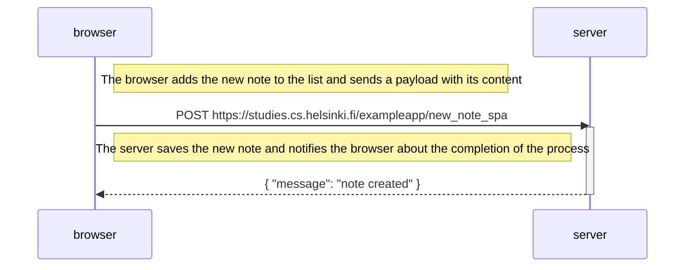

```mermaid
    sequenceDiagram
        participant browser
        participant server

        Note right of browser: The browser adds the new note to the list and sends a payload with its content
        browser->>server: POST https://studies.cs.helsinki.fi/exampleapp/new_note_spa
        activate server
        Note left of server: The server saves the new note and notifies the browser about the completion of the process
        server-->>browser: { "message": "note created" }
        deactivate server
```